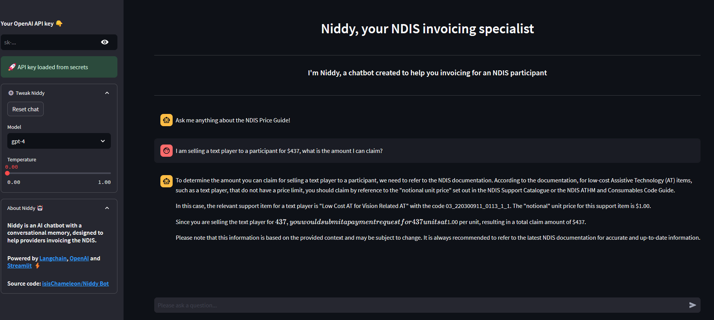
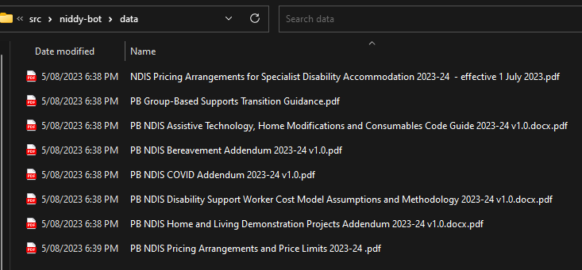

# Niddy Bot

A helpful conversational bot to answer NDIS invoicing questions. 




# Installation

## . 1 Get an OpenAI API Key on https://platform.openai.com/


## . 2 Install Chroma (open source vector database) in server mode in your localhost

First, get docker if you don't have it. https://www.docker.com/products/docker-desktop/

Then:

```
git clone -b 0.3.29 https://github.com/chroma-core/chroma.git

cd chroma

docker-compose up -d --build
```

PS. At the time of writing (9 Sept 2023) it is important to clone that specific version of Chroma because langchain is not yet adapted to the breaking changes.

## . 3 Finally clone this repo.

```
git clone https://github.com/IsisChameleon/niddy-bot.git
```

After cloning the repo create a .env file in the root folder of the repo, just under niddy-bot


In there add the following line with your own OPENAI_API_KEY from step 1.

```OPENAI_API_KEY = 'sk-...'```


## . 4 Add relevant documents

In the data folder, collect the relevant PDF documents from NDIS that you want the bot to answer questions about. They need to be pdfs or csvs files.



e.g. check documents available in this website
https://www.ndis.gov.au/providers/pricing-arrangements


## . 5 Start VSCODE niddy-bot repository folder
If you don't have it already install the "Dev Containers" extension from Microsoft that's going to use the devcontainers: ms-vscode-remote.remote-containers

Once inside the container:

To install all the required python libraries, run ```poetry install```

Run ```streamlit run app.py```


